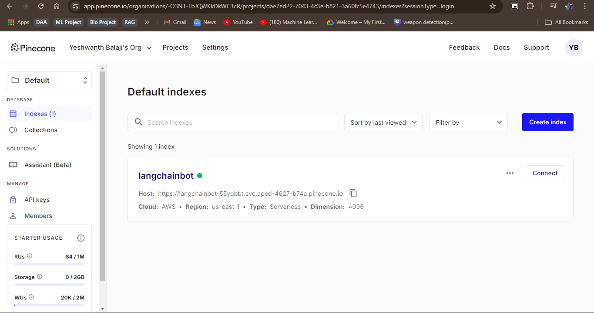
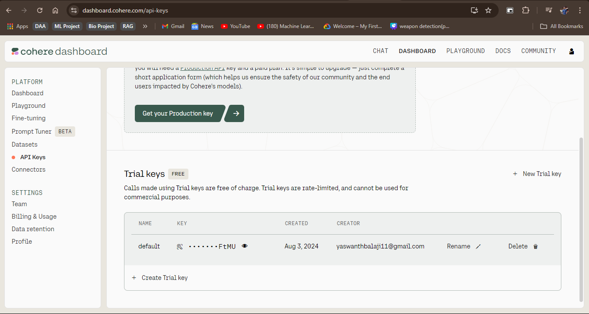

# RagBot (Without Memory)

This project is a Streamlit-based Retrieval-Augmented Generation (RAG) chatbot that processes PDF documents, indexes them using Pinecone, and allows users to query the indexed documents using a Cohere language model. The chatbot provides responses based on the content of the uploaded documents.

## Project Idea

The RAG Chatbot is designed to help users extract information from a collection of PDF documents. By uploading documents, the chatbot processes and indexes them, enabling users to ask questions and receive answers based on the document content. This is particularly useful for large document sets where manual searching would be time-consuming.

## Features

- **PDF Document Upload:** Upload multiple PDF documents for processing.
- **Document Processing:** Automatically chunk and index the documents for efficient retrieval.
- **Question Answering:** Ask questions and receive answers based on the content of the uploaded documents.
- **Cohere & Pinecone Integration:** Utilizes Cohere for language model capabilities and Pinecone for indexing and search.

## How to Use

### Prerequisites

Ensure you have the following before starting:

- **Python 3.8 or higher** installed on your system.
- **API Keys** for Cohere and Pinecone.

### Installation

1. **Clone the repository:**

    ```bash
    git clone https://github.com/YeshwanthBalaji2022/RagBot.git
    cd RagBot
    ```

2. **Install the required dependencies:**

    ```bash
    pip install -r requirements.txt
    ```

3. **Set up your API keys:**

    You'll need to obtain API keys from Cohere and Pinecone.

    - **Cohere API Key:** Sign up on [Cohere's website](https://dashboard.cohere.com/api-keys) to get your API key.
    - **Pinecone API Key:** Sign up on [Pinecone's website](https://www.pinecone.io/) to get your API key.

4. **Run the Streamlit app:**

    ```bash
    streamlit run app.py
    ```

5. **Configure the API keys in the app:**

    When the app runs, you'll be prompted to enter your Cohere and Pinecone API keys in the sidebar. These keys are necessary for the app to function properly.

6. **Upload your PDF documents:**

    Use the file uploader in the sidebar to upload PDF documents. The app will process and index the documents automatically.

7. **Ask questions:**

    Once the documents are processed, you can ask questions in the chat input. The chatbot will provide answers based on the content of the documents.

## Notes

- **Document Processing:** The documents are split into chunks for efficient retrieval, ensuring that the responses are based on specific sections of the documents.
- **No Memory:** This version of the chatbot does not store conversation history or context between questions.


### Pinecone Dashboard


### Cohere Dashboard



## License

This project is licensed under the MIT License.

## Contact

If you encounter any issues or have any questions, feel free to open an issue on the repository or contact me directly.

